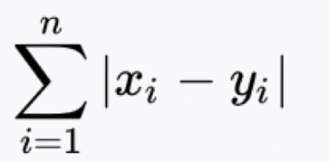
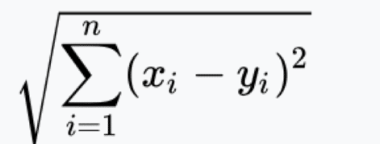
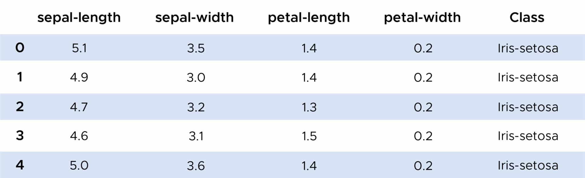

# K nearest Neighbour Algorythmus
**Der K-nearest neighbors (KNN) Algorithmus, wörtlich der K-nächste-Nachbarn-Algorithmus, ist ein Machine-Learning-Algorithmus. Er gehört zur Klasse der einfachen und leicht zu implementierenden überwachten Lernalgorithmen und kann zur Lösung von Klassifikations- und Regressionsproblemen verwendet werden.**

## Definition
Beim überwachten Lernen erhält ein Algorithmus einen Datensatz, der mit entsprechenden Ausgangswerten beschriftet ist, mit dem er trainieren und ein Vorhersagemodell definieren kann. Dieser Algorithmus kann dann auf neue Daten angewendet werden, um die entsprechenden Ausgangswerte vorherzusagen.

1. **Schritt:** Wähle die Anzahl K der Nachbarn aus.
2. **Schritt:** Berechne die Distanz vom nicht klassifizierten Punkt zu anderen Punnkten

3. **Schritt** Nimm die K nächsten Nachbarn gemäß der berechneten Distanz.
4. **Schritt:** Zähle unter diesen K Nachbarn die Anzahl der Punkte, die zu jeder Kategorie gehören.
5. **Schritt:** Ordne den neuen Punkt der Kategorie zu, die unter diesen K Nachbarn am häufigsten vertreten ist.
6. **Schritt:** 

## Anwendungsbeispiel
> Mit der Bibliothek `Scikit-Learn` können wir die Funktion `KKNeighborsClassifier` importieren, die wir auf den IRIS-Datensatz anwenden können. 

Mit dem KNN-Algorithmus erreichen wir eine ausgezeichnete Rate an korrekten Pflanzen-Klassifizierungen von nahezu 100 %. 
Wir können uns auch dafür interessieren, wie wir K für eine optimale Klassifizierung auswählen können.

In der Grafik können wir sehen, dass die beste Vorhersagequote bei K zwischen 5 und 18 liegt. Oberhalb dieses Wertes können wir ein Phänomen namens „Overfitting“ beobachten, das auftritt, wenn die zur Erstellung eines Modells verwendeten Lerndaten die Daten sehr gut oder sogar „zu gut“ erklären, aber keine nützlichen Vorhersagen für neue Daten machen können.

## Anwendungen
- OCR (Optical Character Recognizer, dt. optische Zeichenerkennung) - versucht, Handschriften, Bilder und sogar Videos zu erkennen
- Kreditratings - versucht, die Merkmale einer Person mit der vorhandenen Gruppe von Personen abzugleichen, um ihr die Kreditwürdigkeit zuzuordnen.

## Bewertung
### Vorteile
- einfach und leicht zu implementieren. 
- nicht notwendig, ein Modell zu erstellen, Parameter einzustellen oder zusätzliche Annahmen zu treffen.
- vielseitig einsetzbar - Kann sowohl für Klassifizierung als auch für Regression verwendet werden.

### Nachteile
- Wird mit zunehmender Anzahl von Beobachtungen und unabhängigen Variablen wesentlich langsamer.